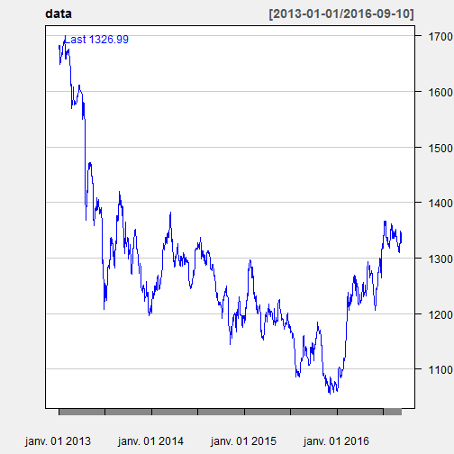

Data Product Capstone
========================================================
author: Axel Perruchoud
date: 10.09.2016
autosize: true

Precious Metals Prices, a small App made with Shiny

transition: concave

Goal
========================================================

The client is interested in some small widget that would allow hom to follow the prices of precious metals.
The requirements are:

- The app must be reactive
- The app must be fast
- The app must be hosted online

With these requirements, a snall app was created using Shiny and the quantmod library.

The app can be tried here:
https://datascienceproject.shinyapps.io/PreciousMetalPrices/

transition: fade

Quantmod - Getting and Displaying the Data
========================================================

Quantmod allows to get the data for stocks and precious metals. Here are the key lines of code:


```r
    library(quantmod)

    # Download daily metals (here gold) prices from oanda.
    data <- get(getMetals(Metals = "XAU", 
                          from = "2013-01-01", to = Sys.Date(),
                          base.currency="USD"))

    # Display the data in a financial chart
    chartSeries(data, theme = chartTheme("white", up.col = 'blue'))
```



transition: rotate


Example - Case study
========================================================

What happened to Gold since the beggining of the year?


With a performance of 25.9%, people who have gold must be happy this year. What about the last five years?


transition: zoom

Quantmod - Displaying the data
========================================================


